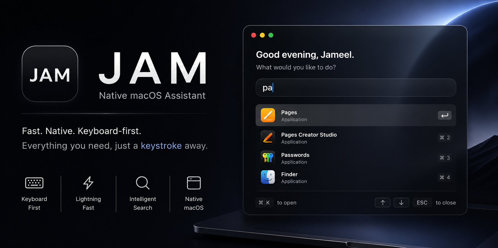

<p align="center">
  
</p>

# JAM

### Native macOS Assistant built with SwiftUI

*A fast, keyboard-first assistant for macOS.*


---

## Overview

JAM is a native macOS application designed to provide a fast, keyboard-first experience for launching installed applications.

Built entirely with **SwiftUI** and **AppKit**, the project focuses on clean architecture, native performance, and a polished user interface inspired by modern macOS design.

The current implementation includes real-time application indexing, fuzzy search, live suggestions, keyboard navigation, and native application launching.

---

## Features

- Native SwiftUI + AppKit architecture
- Automatic indexing of installed macOS applications
- Real-time fuzzy search
- Live suggestion panel
- Native application icons
- Keyboard navigation
  - ↑ / ↓ to navigate suggestions
  - Tab to autocomplete
  - Enter to launch
  - Esc to clear input
- Glassmorphism-inspired interface
- Modular project architecture
- Design token system for colors, spacing, typography and materials

---

## Project Structure

```
JAM
│
├── app/
│   └── JAM
│       ├── Core
│       ├── Design
│       ├── Services
│       ├── UI
│       └── JAM.xcodeproj
│
├── docs
├── assets
└── README.md
```

---

## Technology Stack

- Swift
- SwiftUI
- AppKit
- Xcode
- Git
- GitHub

---

## Current Status

Current Version: **v0.2**

Implemented:

- Application Registry
- Search Index
- Suggestion Engine
- Command Parsing Foundation
- Native Launcher
- Keyboard Navigation
- Custom Glass UI Components

---

## Repository

```bash
git clone git@github.com:Jameel241/JAM-.git
```

---

## License

This project is licensed under the MIT License.

See the [LICENSE](LICENSE) file for details.
